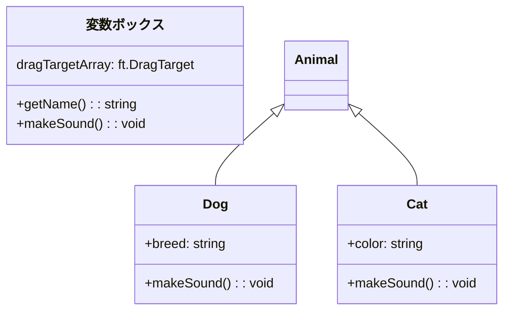

```mermaid
classDiagram
  class 変数ボックス {
    dragTargetArray: ft.DragTarget
    +getName(): string
    +makeSound(): void
  }

  class Dog {
    +breed: string
    +makeSound(): void
  }

  class Cat {
    +color: string
    +makeSound(): void
  }

  Animal <|-- Dog
  Animal <|-- Cat

```

| テキスト | テキスト | テキスト |
| -------- | -------- | -------- |
| テキスト | テキスト | テキスト |
| テキスト | テキスト | テキスト |
| テキスト | テキスト | テキスト |
